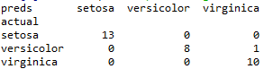

# Random Forest
## 1.个体与集成
### 1.1 概念
集成学习通过构建并结合多个学习器来完成任务。\
如图8.1为集成学习的一般示意图，先产生一组“个体学习器”，再通过某种策略将各个个体学习器进行结合。如何选择个体学习器以及对学习器进行结合是集成学习的重点。\
个体学习器一般为普通的机器学习算法。如，C4.5决策树算法，BP神经网络算法等。如果在一次集成学习算法中，所有的个体学习器属于同一种算法，我们称这种集成算法为同质集成。如果不全都相同，称为异质集成。\

### 1.2 个体学习器的要求
为了获得好的集成效果，个体学习器应该“好而不同”。
即，个体学习器要有一定的“准确性”，即学习器不能太坏。
同时要有“多样性”，即学习器之间要有差异性。
## 2. 集成学习的分类
根据个体学习器的生成方式，目前的集成学习分为两种，一种是个体分类器之间存在强依赖关系、必须串行生成的序列化方法，如boosting.一种是个体学习器之间不存在强依赖关系，可以同时生成的并行化方法,如bagging和随机森林。
### 2.1 boosting
boosting 是一种可以将弱分类器训练为强分类器的方法。这种集成方法的大致过程是：先针对原始数据集训练一个基分类器，然后根据此基分类器在数据集中的表现对数据进行重分布，使得在分类器中表现不好的数据集在之后能得到更多的关注，用新数据集训练下一个基分类器，重复进行，知道基分类器数量达到指定值。最终将这T个基学习器进行加权结合。\
boosting方法中比较特殊的是两个权重，一个是数据的权重，另一个是分类器的权重。\
boosting方法中最经典的是adaboost方法。Adaboost方法比较容易理解的方法是"加性模型"，即基学习器的线性组合 
\
来最小化损失函数 \
\
##### 使用指数优点：\
连续可微函数，可以用它来代替0/1损失函数作为优化目标。\
##### adaboost优点：\
能基于泛化能力弱的弱分类器构建出很强的集成。\
##### adaboost缺点：
* 分类错误的样本，其权重会指数级增加，模型的抗噪能力弱
* 弱分类器耗时长
* 普通的adaboost只适合处理二分类问题
### 2.2 bagging 
通过自助采样法采样出T个含有m个训练样本的采样集，然后基于每个采样集训练出一个基学习器，再将这些基学习器进行结合。这就是bagging的基本流程。\
##### 优点：
* bagging能不经修改的用于多分类回归等任务。
* 在不剪枝决策树、神经网络等易受样本干扰的学习器上效果明显，样本抗干扰性强。
### 2.3 Random Forest
随机森林是bagging方法的一个变体。
##### 差异体现在：
* 随机森林的基学习器都是决策树
* 在决策树的训练过程中引入了随机属性选择
传统的决策树每次选择属性都是从当前节点的所有属性中选择最佳属性，而随机森林方法每一个决策树最佳属性的选择范围却不是在所有属性中挑选，而是在随机选择的k个属性中选择。\
##### 随机森林优点：
简单、易于实现、计算开销小\
随机森林基学习器的多样性不仅来自于样本扰动，而且来自属性扰动，所以最终集成的泛化性能可通过个体学习器之间的差异度增加而进一步提升。
## 3. 结合策略
学习器进行结合会带来三个方面的好处
* 从统计的方面看，集合多个学习器会提高泛化能力
* 从计算方面看，多次运行后集合可以避免陷入局部极小点
* 从表示方面看，多个学习算法可以学到更好地近似
常见的结合算法有三种：平均法，投票法，学习法
### 3.1 平均法
对于数值型输出，最常见的结合方法是平均法，平均法分为，简单平均法和加权平均法。
* 简单平均法：将各个学习器的输出结果进行平均
* 加权平均法：将各个学习器输出结果乘以权重进行求和。
加权平均法的权重一般是由训练数据学习到的，加权平均法未必由于简单平均法，一般而言，对于个体学习器性能相差较大时使用加权平均法，对个体学习器性能接近时使用简单平均法。
### 3.2 投票法
对于分类问题，一般使用投票法，投票法分为三种，绝对多数投票法，相对多数投票法以及加权投票法。
* 绝对多数投票法：若某标记得票超过半数，则预测为该标记，否则 *拒绝预测*
* 相对多数投票法：得票最多的标记为预测值
* 加权投票法：与加权平均法类似，个体学习器的输出结果乘以各自的权重。
### 3.3 学习法 
当训练数据较多时，可以使用学习法。即通过另一个学习器来进行结合。代表方法是stacking之前结合策略只是对学习器输出结果的简单逻辑运算，而学习法是通过另一个学习器，以基学习的预测结果为输入，以训练集的结果为输出进行训练。
## 4. 代码实现
```python
from sklearn.datasets import load_iris
from sklearn.ensemble import RandomForestClassifier
import pandas as pd
import numpy as np

iris = load_iris()
df = pd.DataFrame(iris.data, columns=iris.feature_names)
df['is_train'] = np.random.uniform(0, 1, len(df)) <= .75
df['species'] = pd.Categorical.from_codes(iris.target, iris.target_names)
df.head()

train, test = df[df['is_train']==True], df[df['is_train']==False]

features = df.columns[:4]
clf = RandomForestClassifier(n_jobs=2)
y, _ = pd.factorize(train['species'])
clf.fit(train[features], y)

preds = iris.target_names[clf.predict(test[features])]
print(pd.crosstab(test['species'], preds, rownames=['actual'], colnames=['preds']))
```

