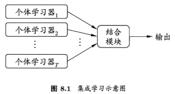
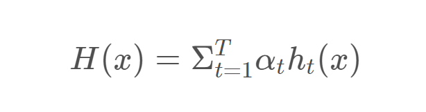
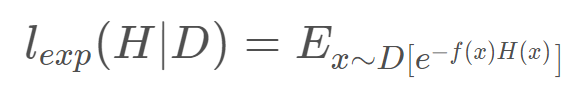

# Random Forest
## 1.个体与集成
### 1.1 概念
集成学习通过构建并结合多个学习器来完成任务。\
如图8.1为集成学习的一般示意图，先产生一组“个体学习器”，再通过某种策略将各个个体学习器进行结合。如何选择个体学习器以及对学习器进行结合是集成学习的重点。\
个体学习器一般为普通的机器学习算法。如，C4.5决策树算法，BP神经网络算法等。如果在一次集成学习算法中，所有的个体学习器属于同一种算法，我们称这种集成算法为同质集成。如果不全都相同，称为异质集成。\

### 1.2 个体学习器的要求
为了获得好的集成效果，个体学习器应该“好而不同”。
即，个体学习器要有一定的“准确性”，即学习器不能太坏。
同时要有“多样性”，即学习器之间要有差异性。
## 2. 集成学习的分类
根据个体学习器的生成方式，目前的集成学习分为两种，一种是个体分类器之间存在强依赖关系、必须串行生成的序列化方法，如boosting.一种是个体学习器之间不存在强依赖关系，可以同时生成的并行化方法,如bagging和随机森林。
### 2.1 boosting
boosting 是一种可以将弱分类器训练为强分类器的方法。这种集成方法的大致过程是：先针对原始数据集训练一个基分类器，然后根据此基分类器在数据集中的表现对数据进行重分布，使得在分类器中表现不好的数据集在之后能得到更多的关注，用新数据集训练下一个基分类器，重复进行，知道基分类器数量达到指定值。最终将这T个基学习器进行加权结合。\
boosting方法中比较特殊的是两个权重，一个是数据的权重，另一个是分类器的权重。\
boosting方法中最经典的是adaboost方法。Adaboost方法比较容易理解的方法是"加性模型"，即基学习器的线性组合 
\
来最小化损失函数 \
\
使用指数优点：\
连续可微函数，可以用它来代替0/1损失函数作为优化目标。\
adaboost优点：\
能基于泛化能力弱的弱分类器构建出很强的集成。\
adaboost缺点：
* 分类错误的样本，其权重会指数级增加，模型的抗噪能力弱
* 弱分类器耗时长
* 普通的adaboost只适合处理二分类问题
### 2.2 bagging 
### 2.3 Random Forest
## 3. 代码实现
